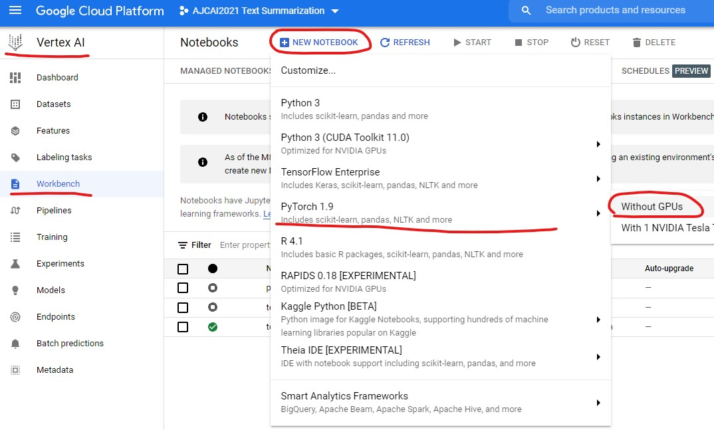
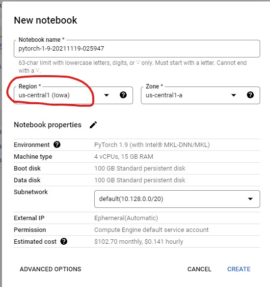
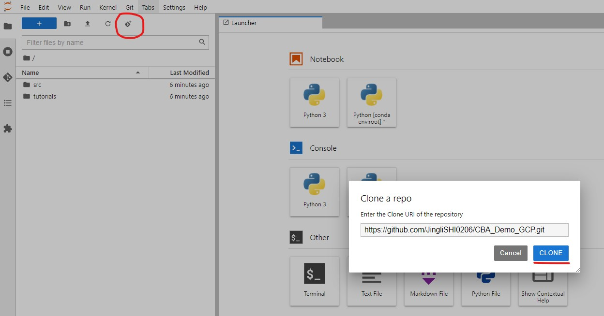
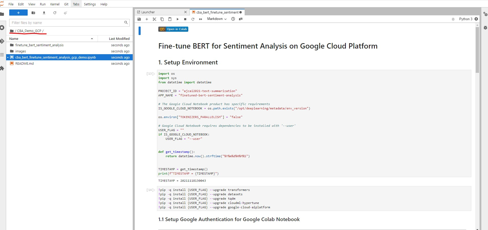
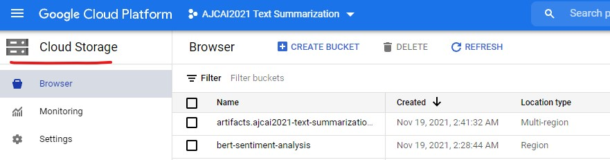
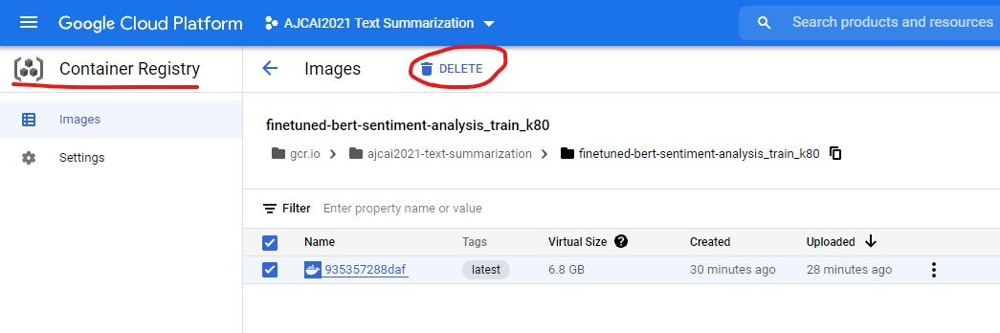
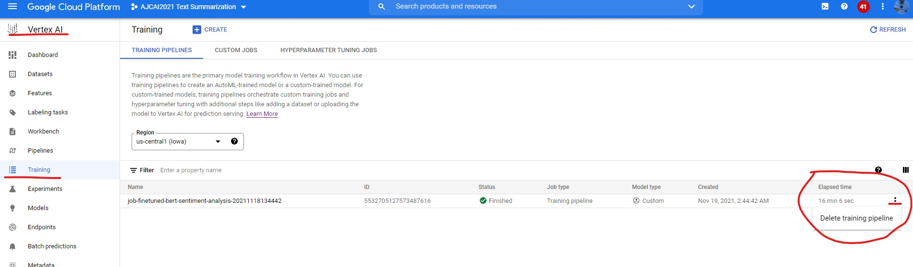
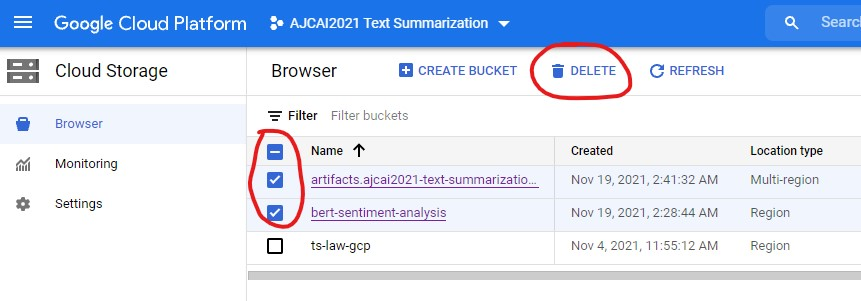
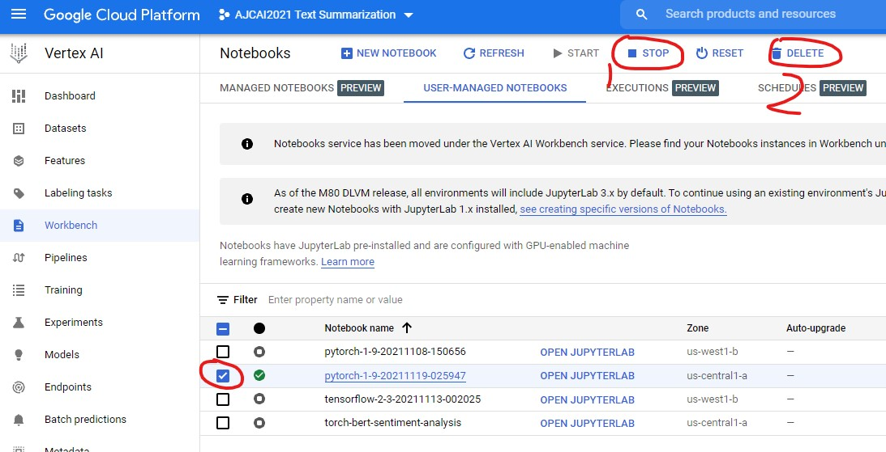

# CBA Demo of GCP

A fine-tune BERT model for sentiment analysis.

## Deploy Demo to GCP

1. Create Vertex AI Notebook







2. Open JupyterLab and Clone Repository

```
clone this repository to gcp vertex ai.
```




3. Run Demo



4. View Files

```
docker file: artifacts.ajcai2021-text-summarization.appspot.com

code package: bert-sentiment-analysis/code/

saved models: bert-sentiment-analysis/models/

```



4. Clean Up 

```
clean up (1) container registry (2) delete training pipeline (3) delete storage files (4) stop notebook and dete

```







